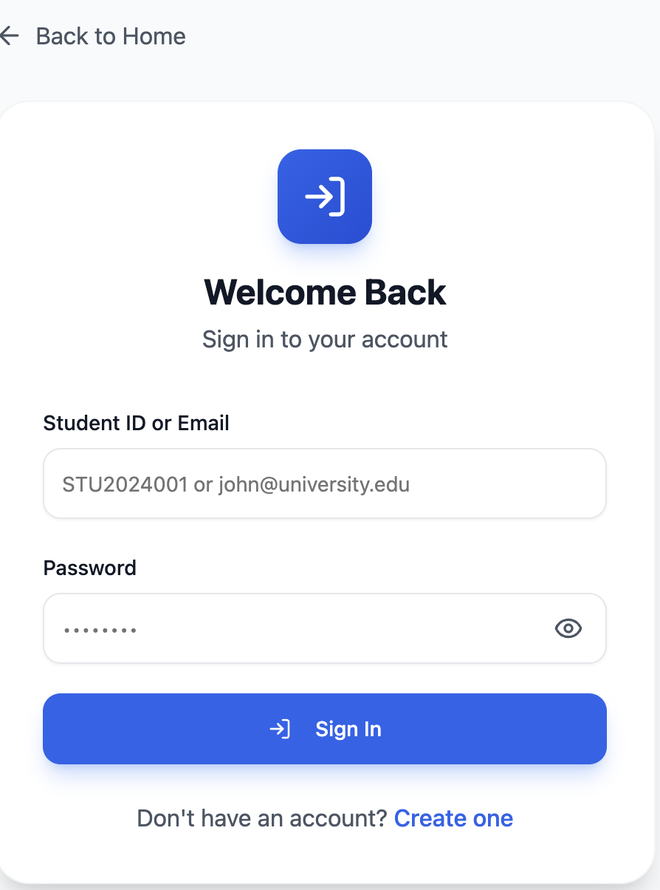
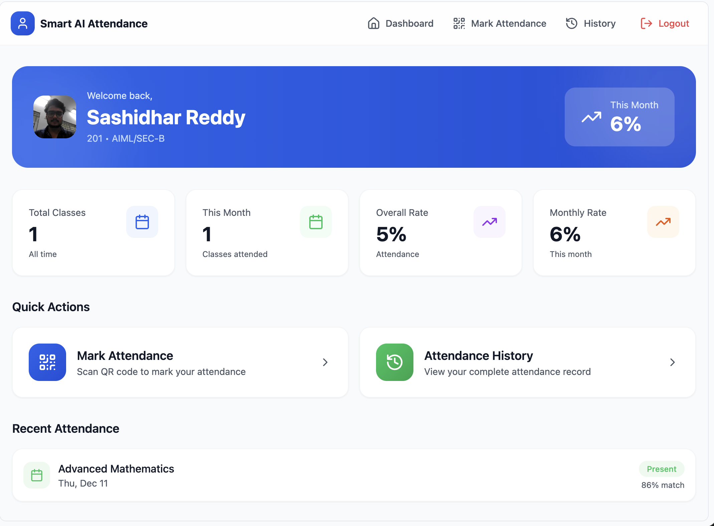
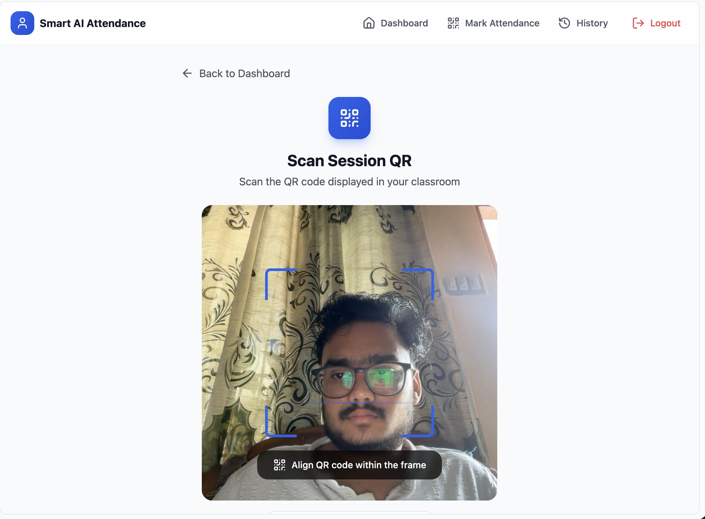
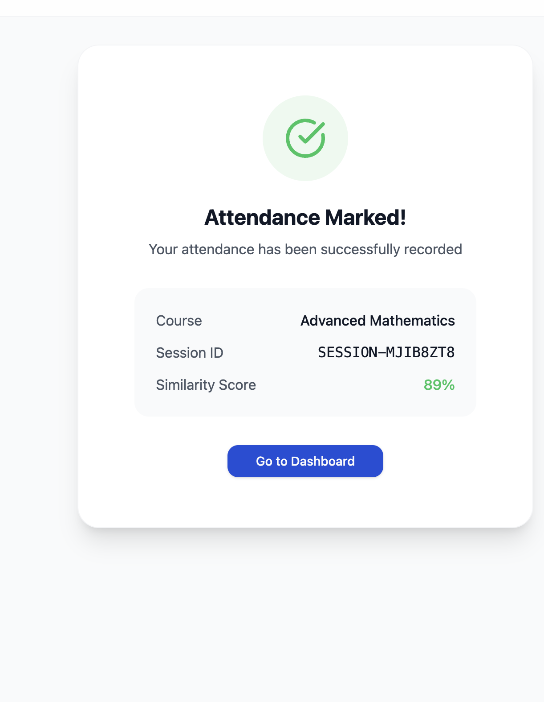

6.1 Introduction to the GUI Dashboard

The Graphical User Interface (GUI) dashboard plays a vital role in the Smart AI Attendance Management System, as it serves as the primary interaction layer between the users and the system. A well-designed dashboard ensures usability, clarity, and smooth navigation while presenting complex processes such as face verification, attendance tracking, and session management in a simplified manner.

In this project, the GUI dashboard is designed with a student-centric approach, focusing on ease of use, minimal learning curve, and clear visual feedback. The dashboard integrates multiple modules such as login, face setup, QR scanning, attendance verification, and attendance history into a unified interface.

The primary objective of the GUI dashboard is to provide a secure, intuitive, and responsive user experience that complements the AI-driven backend processes.

6.2 Design Principles Followed

The dashboard design follows several important UI/UX principles to ensure effectiveness and usability:

6.2.1 Simplicity

The interface avoids unnecessary elements and clutter. Each screen focuses on a single task, such as login, scanning a QR code, or verifying identity.

6.2.2 Consistency

Consistent color schemes, fonts, icons, and layouts are used across all screens to create familiarity and reduce confusion.

6.2.3 Feedback-Oriented Design

The system provides real-time feedback using messages, progress indicators, and alerts during important operations such as face verification and attendance submission.

6.2.4 Mobile-First Approach

Since students often use mobile devices, the dashboard is designed to work efficiently on smartphones, tablets, and desktops.

6.3 Major GUI Components

The GUI dashboard consists of several interconnected screens, each serving a specific purpose in the attendance workflow.

6.3.1 Landing Page

The landing page acts as the entry point to the system. It introduces the project and highlights its core features.

Key Elements:

Project title and branding

Brief description of AI-based attendance

Navigation buttons for login and signup

Feature highlights such as face recognition and liveness detection

This page creates the first impression and communicates the purpose of the system clearly to the user.

6.3.2 Student Registration (Signup Screen)

The signup screen allows new students to create an account in the system.

Features:

Input fields for student name, student ID, email, class/section, and password

Input validation for email format and password strength

Error messages for missing or invalid fields

Secure password handling

This screen ensures that only valid and registered users can access the system.

6.3.3 Student Login Screen

The login screen provides authentication functionality.

Features:

Login using Student ID or Email

Password visibility toggle

Error handling for incorrect credentials

Secure authentication flow

After successful login, the student is redirected either to the face setup screen or directly to the dashboard based on profile completion.

6.3.4 Face Setup Dashboard

This screen allows students to register their reference face, which is later used for identity verification.

Features:

Live camera preview

Face positioning guidance

Capture and preview of reference image

Confirmation before saving

This step ensures that the system has a valid face reference for each student.

6.3.5 Student Dashboard (Home Screen)

The student dashboard is the central control panel of the application.

Displayed Information:

Student profile information

Attendance statistics

Monthly attendance percentage

Recent attendance records

Quick Actions:

Mark Attendance

View Attendance History

This dashboard provides a summarized overview of student activity in an easily understandable format.

6.3.6 QR Code Scanning Screen

This screen enables students to scan the QR code displayed in the classroom.

Features:

Camera-based QR scanning

Session information display after scan

Manual scan simulation (for demo purposes)

Navigation to face verification

This step ensures that attendance is linked to a valid session.

6.3.7 Face Verification Screen

The face verification screen is one of the most important components of the GUI.

Workflow:

Front camera liveness detection

Front selfie capture

Back camera classroom image capture

Submission for AI verification

Visual Feedback:

Countdown timers

Liveness detection indicators

Success or failure messages

Progress spinners

This screen bridges the frontend with the AI backend, ensuring authenticity.

6.3.8 Attendance History Screen

The attendance history screen allows students to review past attendance records.

Features:

Date-wise attendance grouping

Course details

Attendance time

Face similarity percentage

Filters for month-wise view

This screen improves transparency and helps students track their attendance performance.

6.4 Navigation Flow of the GUI

The GUI follows a clear and logical navigation flow:

Landing Page

Login / Signup

Face Setup (first-time users only)

Student Dashboard

QR Scan

Face Verification

Attendance Confirmation

Attendance History

This structured flow ensures that users complete each required step in the correct order.

6.5 Responsiveness and Accessibility

The GUI is designed to be responsive across different screen sizes.

Key Considerations:

Adaptive layouts for mobile and desktop

Large buttons for touch interaction

Clear typography for readability

High-contrast colors for visibility

These considerations improve usability for a diverse user base.

6.6 Security Considerations in GUI Design

Although security is primarily handled at the backend, the GUI also contributes to system safety.

Security Measures:

Restricted access to authenticated pages

No exposure of sensitive data in UI

Secure handling of images before submission

Session-based navigation

This ensures that the frontend does not become a weak link in the system.

6.7 Advantages of the GUI Dashboard

Easy to use for non-technical users

Reduces training effort

Provides real-time feedback

Enhances trust through transparency

Integrates smoothly with AI services

